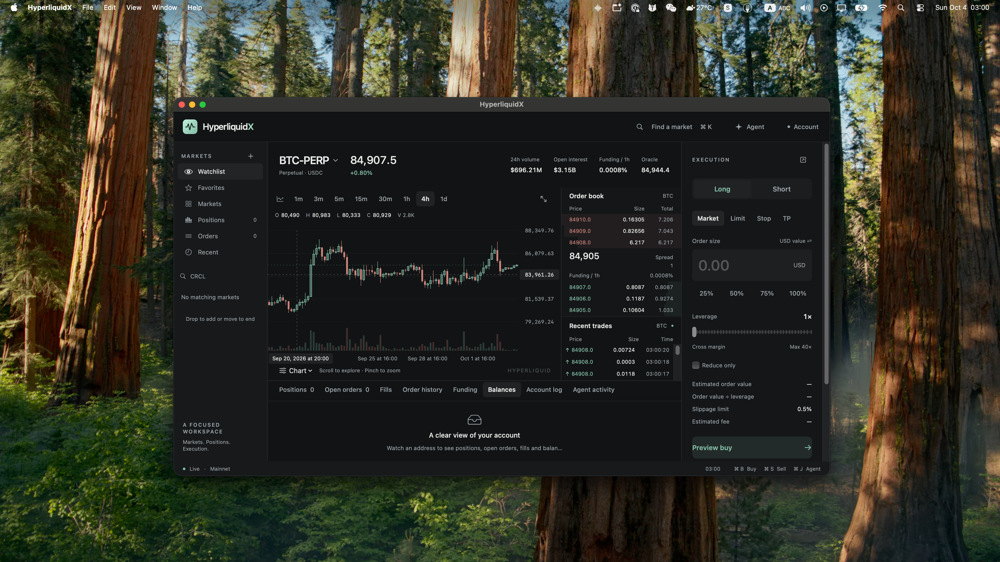

  

  

  <strong>A native macOS trading workspace for Hyperliquid.</strong> 
  <strong>Live markets, charts, positions and a local Agent — together on your desktop.</strong>

## Features

- 💻 **Native to Mac.** Built with SwiftUI and AppKit, with resizable panels, dark and light appearances, and support for macOS 14 or later.
- ⚡ **Real-time data, managed by the client.** Persistent WebSocket feeds, heartbeat, reconnect, stale-data detection and frame-batched updates keep markets and account activity in sync. Market data runs independently of browser tabs; late snapshots cannot overwrite newer stream updates.
- 📊 **Charts and depth built for trading.** Canvas candlesticks and volume, crosshair, continuous pan, pointer-anchored zoom and earlier candle history. Price and volume hover use separate coordinates; axis labels avoid overlap and the OHLCV legend adapts to narrow charts. Market changes share a restrained 220ms transition; outgoing quotes cannot prepare orders. Bid and ask depth share a cumulative quantity scale, with stable columns and restrained price-change feedback. Click a fresh order-book quote to prepare an order at its received precision; cached quotes cannot fill order fields. Display updates follow the screen refresh rate, capped at 120 Hz, while changed depth publishes at up to 60 Hz. The tape distinguishes trades above $10k, $50k and $100k.
- 🖥️ **A workspace that fits your screens.** Detach order entry into a native execution window, keep your chart in view and move execution to another display. Panel sizes, window positions, favorites and recent markets are saved separately for each network.
- ⌨️ **Keyboard-first workflows.** Find markets with **⌘K**, prepare Buy / Long with **⌘B**, prepare Sell / Short with **⌘S**, and open the workspace Agent with **⌘J**. Preview orders before confirming, with optional hold-to-confirm keyboard input.
- 🎯 **From position to order intent.** Prepare partial closes, take-profit, stop-loss and reversal drafts. Market and limit orders include GTC, IOC and Post Only controls, with account fees, trading capacity and position-risk estimates in the review flow.
- 🔐 **Local signing and risk checks.** Main-wallet keys stay in your wallet extension. An optional wallet-approved trading session keeps its temporary signing key in native app memory. Account, network, balance, position and price-bound checks run before submission; each order still requires a reviewed confirmation.
- ✨ **An Agent with workspace context.** Ask about the selected market, positions, liquidation distance, funding, open interest, orders, recent fills and balances. Prepare editable reduction, TP/SL and reversal intents through the same review flow. The Agent's data tools are read-only.
- 🍎 **Desktop integration.** An optional menu-bar ticker keeps the selected market close at hand. Native commands, persistent workspace layouts and instant mainnet / testnet switching support a familiar Mac workflow.

**On the roadmap:** independent Chart, Order Book, Position Inspector and Agent windows; multi-market monitoring across displays; Keychain / Secure Enclave / Touch ID integration; global shortcuts, native notifications, Dock badges, Spotlight / App Intents, exports, local logs, launch at login and broader background monitoring. Richer Agent requests, such as “Reduce my ETH position by 25%, with at most 0.3% slippage,” and timeframe shortcuts are also planned.

HyperliquidX is in active development. Native interaction and performance validation, wallet compatibility and server-accepted trading verification are still in progress. See [implementation status](docs/STATUS.md) for current coverage and remaining work.

## Build and run

Open [HyperliquidX.xcodeproj](HyperliquidX.xcodeproj), select the **HyperliquidX** scheme and **My Mac**, then press **⌘R**. Use **⌘U** to run tests. The native macOS App Target provides the standard Xcode app, signing, capability and build configuration pages. Requires Xcode 16.3+ and macOS 14+.

Run `zsh scripts/build-app.sh` to package the Xcode Release build into `dist/HyperliquidX.app`. One app supports switching between mainnet and testnet. See the [development guide](docs/DEVELOPMENT.md) for signing settings and the retained Swift Package commands.

## Have a problem?

- 🐛 [Open a GitHub issue](https://github.com/hyperliquidxapp/HyperliquidX/issues/new) for bugs, questions or feature requests.
- 📋 Include your macOS version, app build, network, steps to reproduce and a screenshot when helpful. Remove wallet secrets and sensitive account details from attachments.
- 🔎 Check the [implementation status](docs/STATUS.md) for known gaps and verification progress.

---

HyperliquidX is built for traders who want their markets, tools and decisions in one native Mac workspace. We care about clear data, deliberate execution and making the desktop a better place to trade.

If you'd like to support the project, [star the repository](https://github.com/hyperliquidxapp/HyperliquidX) or share your feedback. Every thoughtful report helps shape what comes next. 💚

**The HyperliquidX team**

  Made for Mac · Built for Hyperliquid 
  <a href="https://github.com/hyperliquidxapp/HyperliquidX">GitHub</a> ·
  <a href="https://github.com/hyperliquidxapp/HyperliquidX/issues">Support</a>

